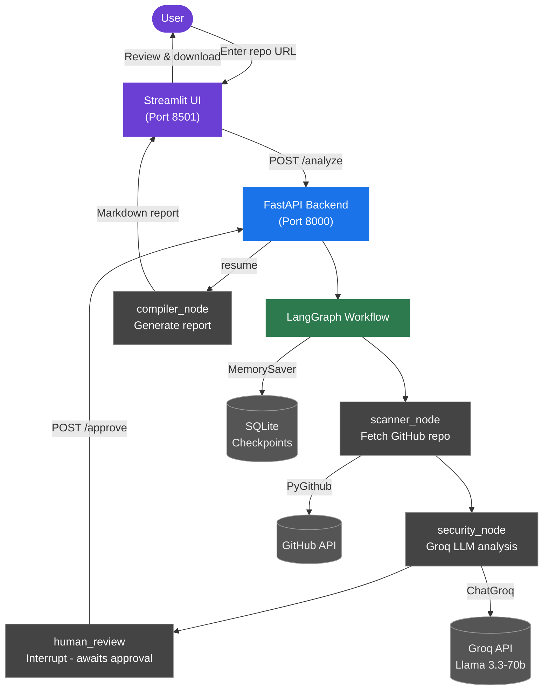
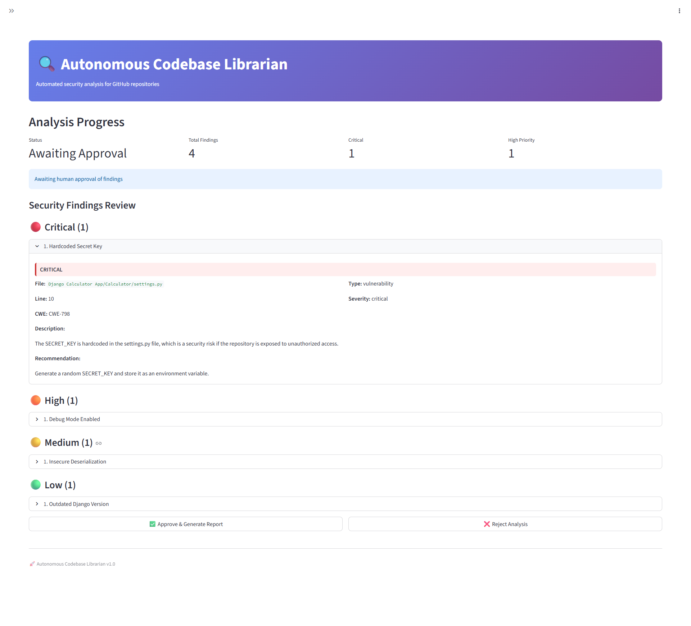
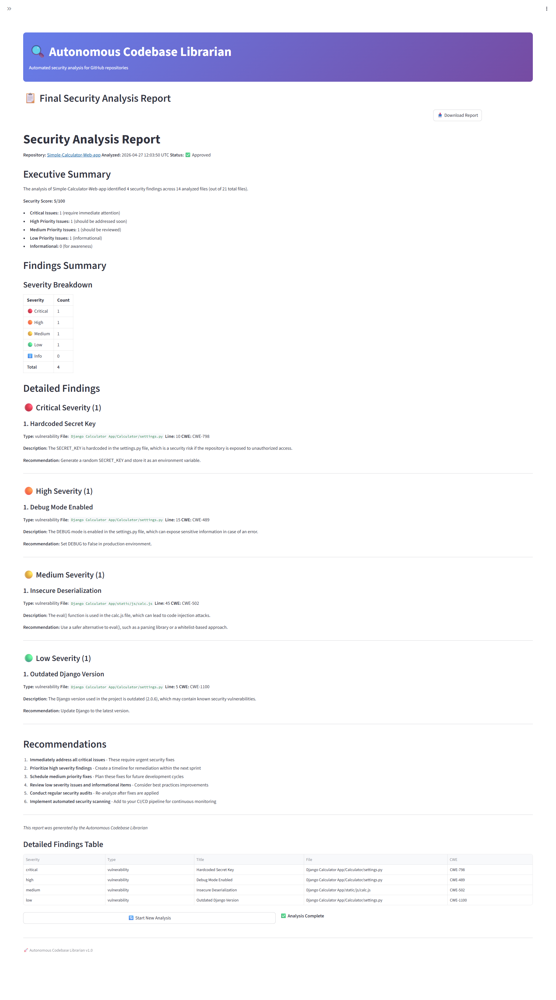
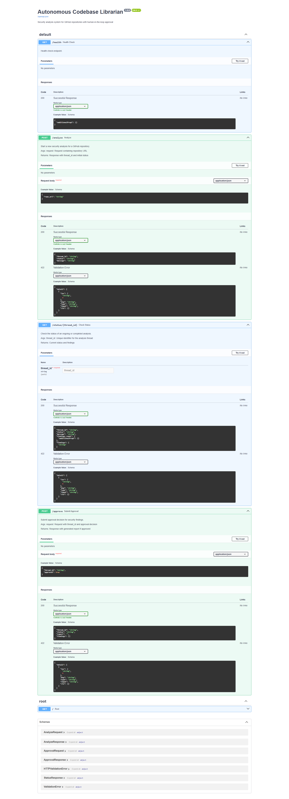
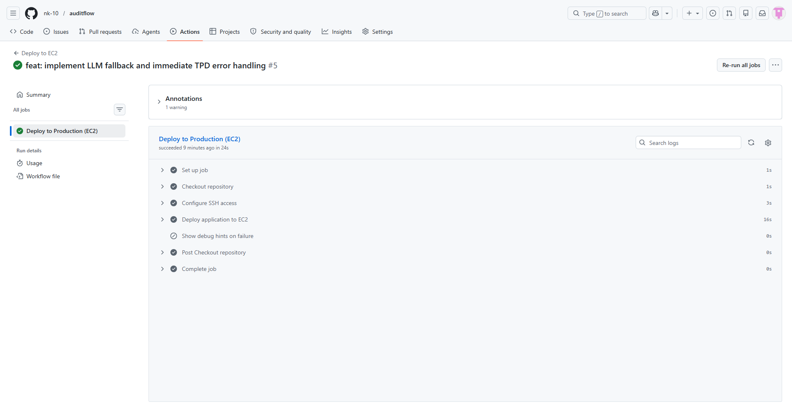

# 🔍 Autonomous Codebase Librarian

A professional-grade, human-in-the-loop security analysis system for GitHub repositories. Uses **LangGraph**, **Groq (Llama 3.3)**, **FastAPI**, and **Streamlit**.

   

**🌐 Live Demo: [http://13.232.213.175/](http://13.232.213.175/)** *(HTTP only — do not enter private API keys; free-tier EC2 instance may occasionally be offline)*

## 🎯 Features

- **Automated Security Analysis**: Analyzes GitHub repositories for:
  - 🔴 Code vulnerabilities (SQL injection, XSS, hardcoded secrets, etc.)
  - 🟡 Dependency vulnerabilities (known CVEs, outdated packages)
  - 🟠 Configuration issues (exposed API keys, insecure defaults)

- **Human-in-the-Loop Approval**:
  - Security findings are presented to humans for review
  - Intelligent interrupt mechanism ensures no report is finalized without approval
  - State persistence allows resuming analysis after approval

- **Professional Reports**:
  - Markdown-formatted security reports
  - Severity-based grouping (Critical, High, Medium, Low)
  - Actionable recommendations for each finding
  - Security severity summary (Critical / High / Medium / Low breakdown)

- **Free AI**: Uses Groq's free tier with Llama 3.3-70b model (no costs!)
  - Automatic fallback to Llama 3.1-8b-instant when the primary model hits rate limits — analysis continues uninterrupted

## 🏗️ Architecture



## 🚀 Quick Start

### Prerequisites

- Python 3.11+
- Groq API key (free at https://console.groq.com)
- GitHub account (optional, for higher rate limits)

### Installation

1. **Clone the repository**
   ```bash
   git clone https://github.com/nk-10/auditflow.git
   cd auditflow
   ```

2. **Create environment file**
   ```bash
   cp .env.example .env        # Linux/macOS
   copy .env.example .env      # Windows
   ```

3. **Add your Groq API key to `.env`**
   ```
   GROQ_API_KEY=your_groq_api_key_here
   ```

4. **Install dependencies**
   ```bash
   pip install -r requirements.txt
   ```

### Running Locally

#### On Linux/macOS:
```bash
chmod +x run.sh
./run.sh
```

#### On Windows:
```cmd
run.bat
```

Then open your browser to: **http://localhost:8501**

### Using Docker

1. **Build the image**
   ```bash
   docker build -f docker/Dockerfile -t auditflow .
   ```

2. **Create `.env` file with your Groq API key**

3. **Run with Docker Compose**
   ```bash
   cd docker
   docker-compose up --build
   ```

4. Access the frontend at http://localhost:8501

## 📖 Usage Guide

### Step 1: Enter Repository URL
1. Navigate to http://localhost:8501
2. Enter a GitHub repository URL (e.g., `https://github.com/psf/requests`)
3. Click **"Analyze"**

### Step 2: Wait for Analysis
- The system will:
  - Fetch repository file structure
  - Analyze files for security vulnerabilities
  - Present findings for review

### Step 3: Review & Approve
- Review all security findings displayed in the UI
- See detailed information for each issue:
  - Severity level
  - File location
  - CWE reference
  - Recommended fixes
- Click **"Approve & Generate Report"** to finalize
- Or click **"Reject Analysis"** to discard



### Step 4: Download Report
- Once approved, download the professional Markdown report
- Report includes:
  - Executive summary
  - Severity breakdown
  - Detailed findings
  - Actionable recommendations



## 🔧 API Reference

> Interactive API docs auto-generated at **`http://localhost:8000/docs`** (Swagger UI).



### POST /analyze
Start a new security analysis for a GitHub repository.

**Request:**
```json
{
  "repo_url": "https://github.com/username/repository"
}
```

**Response:**
```json
{
  "thread_id": "550e8400-e29b-41d4-a716-446655440000",
  "status": "scanning",
  "message": "Analysis started."
}
```

> Poll `GET /status/{thread_id}` to track progress. Status transitions: `scanning` → `analyzing` → `awaiting_approval` → `completed`.

### GET /status/{thread_id}
Check the status of an ongoing or completed analysis.

**Response:**
```json
{
  "thread_id": "550e8400-e29b-41d4-a716-446655440000",
  "status": "awaiting_approval",
  "message": "Awaiting human approval of findings",
  "findings_count": {
    "critical": 2,
    "high": 5,
    "medium": 8,
    "low": 3,
    "total": 18
  },
  "findings": [...]
}
```

### POST /approve
Submit approval decision for security findings.

**Request:**
```json
{
  "thread_id": "550e8400-e29b-41d4-a716-446655440000",
  "approved": true
}
```

**Response (if approved):**
```json
{
  "thread_id": "550e8400-e29b-41d4-a716-446655440000",
  "status": "completed",
  "report": "# Security Analysis Report\n...",
  "findings": [...]
}
```

### GET /health
Health check endpoint.

**Response:**
```json
{
  "status": "healthy",
  "checks": 45
}
```

## 📁 Project Structure

```
auditflow/
├── .github/
│   └── workflows/
│       └── deploy.yml               # GitHub Actions CI/CD pipeline
├── backend/
│   ├── main.py                      # FastAPI application
│   ├── config.py                    # Configuration management
│   ├── graph.py                     # LangGraph workflow definition
│   ├── types.py                     # AnalysisState TypedDict
│   ├── nodes/
│   │   ├── scanner_node.py          # GitHub repo scanning
│   │   ├── security_node.py         # Security analysis
│   │   ├── human_review_node.py     # Human approval interrupt
│   │   └── compiler_node.py         # Report generation
│   └── utils/
│       ├── github_client.py         # GitHub API wrapper
│       ├── security_analyzer.py     # Groq-based analysis
│       └── report_generator.py      # Markdown report creation
├── frontend/
│   └── app.py                       # Streamlit UI application
├── docker/
│   ├── Dockerfile                   # Docker image definition
│   └── docker-compose.yml           # Docker composition file
├── docs/
│   ├── DEPLOYMENT.md                # Production deployment guide (AWS EC2)
│   └── screenshots/                 # README screenshots
├── requirements.txt                 # Python dependencies
├── .env.example                     # Environment template
├── run.sh                           # Linux/macOS startup script
├── run.bat                          # Windows startup script
├── LICENSE
└── README.md                        # This file
```

## 🔐 Security Notes

- **API Keys**: Keep your Groq and GitHub tokens secure in `.env` (never commit!)
- **State Persistence**: SQLite database stores analysis state - ensure proper permissions
- **Content Analysis**: File contents are sent to Groq's API for LLM analysis — ensure you are comfortable sharing repository code with Groq before analyzing private repos
- **GitHub Access**: Only reads repository contents; respects GitHub's rate limiting

## ⚙️ Configuration

Edit `.env` to customize:

```bash
# Groq API Configuration
GROQ_API_KEY=your_key_here

# GitHub Token (optional, for higher rate limits)
GITHUB_TOKEN=your_github_token

# API Server
API_HOST=0.0.0.0
API_PORT=8000

# Frontend
STREAMLIT_HOST=0.0.0.0
STREAMLIT_PORT=8501
BACKEND_URL=http://127.0.0.1:8000

# Database
DB_PATH=./data/checkpoints.db

# Debug Mode
DEBUG=false
```

## 🛠️ CI/CD & Deployment

### GitHub Actions (Automatic Deploy on Push)

Pushing to `main` triggers an automatic deployment to an AWS EC2 instance via GitHub Actions (`.github/workflows/deploy.yml`).

**Required GitHub Secrets:**

| Secret | Description |
|--------|-------------|
| `EC2_SSH_PRIVATE_KEY` | Private SSH deploy key for EC2 access |
| `EC2_HOST` | Elastic IP address of the EC2 instance |
| `EC2_USER` | SSH username (e.g. `auditflow`) |

**What the pipeline does:**
1. SSH into the EC2 instance
2. Pull latest code from `main`
3. Install/update Python dependencies in the virtual environment
4. Restart `auditflow-backend` and `auditflow-frontend` systemd services
5. Health-check both services with `curl`

### Full Production Setup



See [docs/DEPLOYMENT.md](docs/DEPLOYMENT.md) for step-by-step instructions covering:
- AWS EC2 Free Tier setup with Elastic IP
- Nginx reverse proxy configuration
- systemd service files
- Security hardening and monitoring

## 🧪 Testing

### Manual Testing Checklist

- [ ] Start analysis with valid repo URL
- [ ] Wait for interrupt at review stage
- [ ] Verify findings display correctly
- [ ] Approve findings and generate report
- [ ] Download generated report
- [ ] Verify report contains all sections
- [ ] Test rejection workflow
- [ ] Test with different repository sizes
- [ ] Verify error handling for invalid URLs
- [ ] Check database persistence after restart

### Example Test Repositories

- Small: https://github.com/pallets/flask
- Medium: https://github.com/psf/requests
- Large: https://github.com/psf/black

## 📊 Supported Analysis

### Code Vulnerabilities Detected

- SQL Injection patterns
- XSS (Cross-Site Scripting) vulnerabilities
- Command Injection risks
- Hardcoded secrets and API keys
- Insecure deserialization
- Unsafe file operations
- Weak cryptography usage

### Dependency Checks

- Known CVEs in packages
- Outdated package versions
- Missing security patches
- Insecure package configurations

### Configuration Issues

- Exposed secrets in config files
- Debug mode enabled in production
- Overly permissive file permissions
- Missing authentication/authorization
- Insecure default settings

## ⚡ Performance Considerations

- **File Limit**: Analyzes up to 100 files per repository (configurable)
- **File Size**: Skips files larger than 1MB
- **Groq Rate Limit**: ~30 requests/minute on free tier; automatic fallback to `llama-3.1-8b-instant` on tokens-per-day exhaustion
- **Analyzed Files**: Key files (code, config, dependencies) are prioritized
- **Per-request Limits**: App caps each LLM call at 4,000 output tokens and 1,200 chars per file (configurable in `backend/config.py`)

## 🤝 Contributing

Improvements welcome! Areas for enhancement:

- Support for more repository platforms (GitLab, Bitbucket)
- Integration with issue tracking systems
- Automated fix suggestions
- Custom vulnerability rules
- Enhanced report templates
- Performance optimizations

## 📝 License

MIT License. See [LICENSE](LICENSE) for details.

## 🆘 Troubleshooting

### Backend won't start
```bash
# Check if port 8000 is already in use
lsof -i :8000  # Linux/macOS
netstat -ano | findstr :8000  # Windows
```

### Groq API errors
```bash
# Verify API key is valid
curl -H "Authorization: Bearer YOUR_KEY" https://api.groq.com/openai/v1/models
```

### Frontend can't reach backend
```bash
# Check BACKEND_URL in .env
# Default: http://127.0.0.1:8000
# In Docker: http://backend:8000
```

### Analysis timeout
- Reduce `max_files_to_analyze` in `backend/config.py`
- Reduce `llm_max_tokens` in `backend/config.py` to speed up each LLM call

## 📞 Support

For issues and questions:
1. Check the troubleshooting section above
2. Review FastAPI logs: Check terminal output
3. Check Streamlit logs: Check terminal running `streamlit run`
4. Review database: `sqlite3 data/checkpoints.db`

## 🎓 Learning Resources

- [LangGraph Documentation](https://langchain-ai.github.io/langgraph/)
- [Groq API Docs](https://console.groq.com/docs)
- [FastAPI Docs](https://fastapi.tiangolo.com/)
- [Streamlit Docs](https://docs.streamlit.io/)

---

**Made with ❤️ by Nitin | Autonomous Codebase Librarian v1.0**
